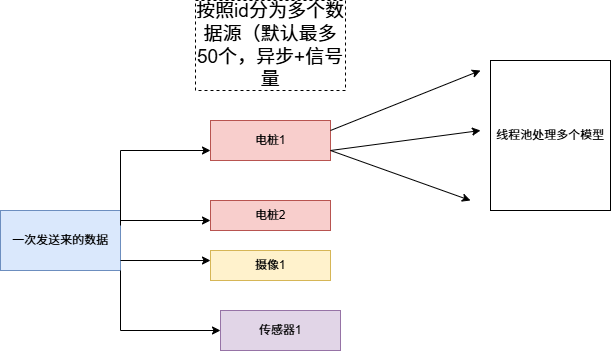

# 多数据源的算法服务层系统

## 项目简介

本项目是一个高效、可扩展的对多数据源提供算法服务的系统后端框架，旨在为数据源实时监控和管理提供 AI 支持的预测处理和高并发支持。此项目结合了数据接收、实时预测、WebSocket 通讯、缓存机制等核心功能。

## 主要功能

- **实时充电桩数据处理**：支持每秒接收多达 50 数据源的数据，并实时返回预测结果。
- **并发任务处理**：通过异步编程和 `asyncio.Semaphore` 控制并发任务，确保系统稳定高效运行。
- **模型预测**：支持不同机器学习模型（如逻辑回归和神经网络）预测充电桩的状态。
- **WebSocket 通讯**：通过 WebSocket 实现前后端实时数据传输和通知。
- **数据缓存**：使用内存缓存机制减少重复计算，提高预测效率。
- **认证机制**：内置 API 密钥认证，确保安全性。
- **高可扩展性**：易于添加更多模型和数据源，支持高并发场景。

## 技术栈

- Python 3.x
- `asyncio` 用于异步任务处理
- `aiohttp` 实现 WebSocket 和 HTTP 服务
- 机器学习模型（如 scikit-learn、 PyTorch）
- 缓存（`TTLCache`）
- 日志记录（`logging`）

## 安装和使用

### 安装依赖

python -m venv env 

env/Scripts/activate

pip install -r requirements.txt

### 运行
cd project 

python main.py

## 使用方式
- 此系统目前是（只）支持pkl格式的模型文件，我们可以在configs目录下的settings.yaml里指定我们的模型的路径和名字（该配置文件还可以指定最大数据源的数量，缓存时间等，可以根据算力和需求更改），然后在我们的main.py里的 model_map结构体里添加注册的新的模型。每一个新的模型需要继承models文件下的base_mdoel类并实例化自己的类来初始化模型和处理数据等。

- 整体流程（从数据的角度）

- send_data.py是我用于测试该后端的文件，可以通过运行这个代码来测试我们的系统
## 不足！！！（针对电桩系统）
- 目前对接电桩系统（或其他系统），第一个数据传输的历史遗留问题可以去看services类里的websocket_server.py，可能要修改我们的数据传输的格式。

- 此外，我们的性能依然有可优化的空间，目前的复杂度可能在O(n2)，可以优化到O(n)。（根据新的传输过来的数据格式来定），

- 目前已经实现的模型在wait-traning里看到，里面lg和nn是用于测试的，其它的模型实现了图像识别火灾，通过电压温度判断危险，通过几个专业的指标判断断路相关的危险。（可在该框架下继续实现其它模型，只要训练好模型添加pkl文件的路径进来就行）
- utils里面代码没有实现，可以在部署后继续优化
- 有缓存数据机制，cache.py可以看到，可以为时间序列相关的模型预测提供数据

## 本项目仅是个人开发，如有问题欢迎讨论